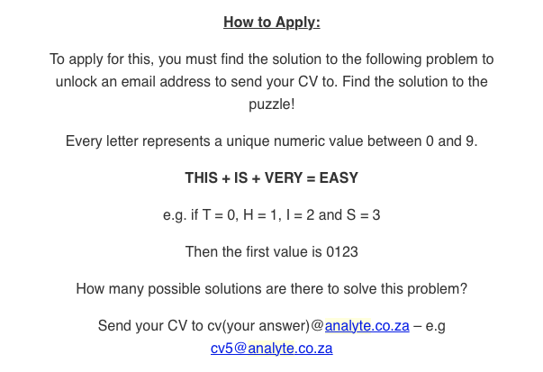
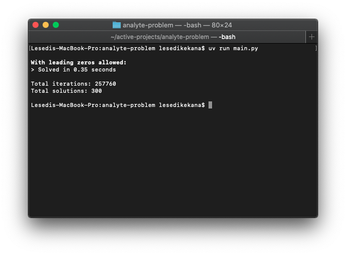
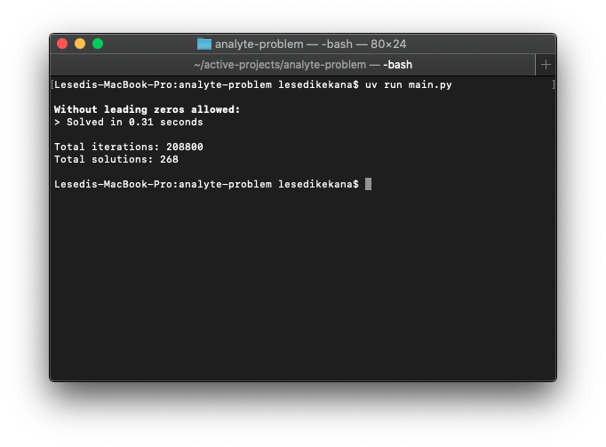

# Cryptarithm Solver

A Python-based solver for the cryptarithmetic puzzle featured in [Analyte's Graduate Program](https://www.analyte.co.za) application (Dec 2025).

This repository contains a Python script that solves the cryptarithmetic puzzle:

$$ THIS + IS + VERY = EASY $$

Each letter represents a unique digit (0–9), and no number may begin with zero.

## Background

In early 2026, I was a CS graduate *aggressively* looking for a job and came across Analyte's graduate program application, which included this puzzle.



After sitting with it for hours on multiple days trying to find the number of solutions by hand (and overcoming the frustration of having forgotten some of the discrete math methods for approaching problems like this), I realised that I had reduced the scope of the problem enough mathematically that I could find the solution using code. (I am a software engineer, after all lol)

With that, I used the constraints I had derived and wrote a simple solver in Python to find all valid mappings of letters to digits that satisfy the equation.

## Constraints

Given constraints:
- Each letter (T, H, I, S, V, E, R, Y, A) represents a unique digit from 0 to 9.
- The equation must hold true: `THIS + IS + VERY = EASY`.
- The total number of unique letters is 9, so we are working with a subset of the digits 0–9.
- The sum of the digits corresponding to the letters must satisfy the arithmetic constraints of the equation, including carry-over rules.

With this, we can derive additional constraints to reduce the search space:

### 1. The existence of carries in the addition
Since each letter represents a digit, sometimes when we add 2 or more digits, we may get a sum greater than 9, eg. `5 + 7 = 12` so 1 is carried over to the next column.

So I rewrote the equation with the carry variables introduced:
```
  T H I S
+     I S
+ V E R Y
+ c b a 0
---------
  E A S Y
```

where `c`, `b`, and `a` are the carry digits for the respective columns.

### 2. Range of carries

Since the carries are the result of adding 3 digits together, the largest digit is 9, so at most we can have `9 + 9 + 9 = 27`, which means the carry can only be 0, 1, or 2.

### 3. Range of `S`

With our inclusion of the carry variables above, we can rewrite the problem into 4 separate equations:
```
1. `S + S + Y = Y + (10 * a)`
2. `I + I + R + a = S + (10 * b)`
3. `H + E + b = A + (10 * c)`
4. `T + V + c = E`
```

From the first equation, we can derive that `S`,
`S + S + Y = Y + (10 * a)`
=> `2S + Y = Y + (10 * a)`
=> `2S = 10 * a`
=> `S = 5 * a`

Thus, in the range `0-9`, `S` can only be `0` or `5`. We also see that `a` can only be `0` or `1` (this will be important in the next constraint).

### 4. Range of `R` and Restrictions on `I`

Since we only have 2 possible values for `S` (0 or 5), we can derive the possible values for `R` from the second equation:
```
I + I + R + a = S + (10 * b)
=> 2I + R + a = S + (10 * b)
```

#### Case 1: If `S = 0` and `a = 0`
```
2I + R = 10 * b
```

Since, the right hand side is a multiple of 10 (which are all even), the left hand side must also be even.
Thus with `2I` always even, `R` must also be even. Thus, `R` can only be `0`, `2`, `4`, `6`, or `8`.

Also, note that if `I = 0` or `I = 5`, then `2I` would be `0` or `10`, which would mean that `R` would have to be zero or a multiple of 10 (which is not possible since `S = 0`, which violates our uniqueness rule and also `R` is a single digit). Thus, `I` cannot be `0` or `5` here.

#### Case 2: If `S = 5` and `a = 1`
```
2I + R + 1 = 5 + (10 * b)
=> 2I + R = 4 + (10 * b)
=> 2I + R = (10 * b) + 4
=> 2I + R = 4, 14, 24, ...
```

Since the right hand side is of the form `10 * b + 4`, it can only end with a `4` in the units place, which means the left hand side must also end with a `4` in the units place. Thus, with `2I` always even, we can again conclude that `R` must be even. Thus, `R` can only be `0`, `2`, `4`, `6`, or `8`.

Again note we cannot have `I = 5` here because `S = 5` and that would violate our uniqueness rule. We can have `I = 0` however.

Thus, in both cases, `R` can only be `0`, `2`, `4`, `6`, or `8` and `I` cannot be `5`.

### 5. Restriction on `T` and `V`

Recall that the carries can only be `0`, `1`, or `2`.
So, `c` can only be `0`, `1`, or `2`.

By equation 4 (or the fourth column), we can see that
```
E = T + V + c
```

Since EASY must be composed of unique digits, we assume EASY < 9999 and thus,
```
T + V + c < 10
```

#### Case 1: If `c = 0`
```
E = T + V
```
- If `T = 9` then `V` can only be `0`, but this means `E = 9` which violates our uniqueness rule
- If `V = 9` then `T` can only be `0`, but this means `E = 9` which violates our uniqueness rule

#### Case 2: If `c = 1`
```
E = T + V + 1
```
`T ≠ 9` and `V ≠ 9` because they result in `E = 10` which means `E` would not be a single digit and EASY would not be a valid 4-digit number.

#### Case 3: If `c = 2`
```
E = T + V + 2
```
Again, `T ≠ 9` and `V ≠ 9` because they result in `E = 11` which means `E` would not be a single digit and EASY would not be a valid 4-digit number.

We can therefore conclude that `T` and `V` cannot be `9`.

### Summary of Derived Constraints
- `S` can only be `0` or `5`.
- `R` can only be `0`, `2`, `4`, `6`, or `8`.
- `I` cannot be `5`.
- `T` cannot be `9`.
- `V` cannot be `9`.


## Approach
- Use the constraints above to reduce the search space (e.g., `I ≠ 5`, carry propagation).
- Implement a brute-force search over the reduced domain for correctness and simplicity.
- Confirms there are at least **268 valid solutions**.

## Results

One run of the algorithm found 300 valid solutions for the equation, if we allow the leading digits (i.e. `T` in `THIS` and `V` in `VERY` or `E` in `EASY`) to be zero.



When we enforce the rule that no number can start with zero, we find 268 valid solutions for the equation.



All 300 valid solutions can be found in [`solutions.txt`](./solutions.txt) and the 268 valid solutions that satisfy the leading zero constraint can be found in [`l_solutions.txt`](./l_solutions.txt).

## Why I Published This
I originally solved this as part of a graduate program application (Analyte, Dec 2025). After submitting my solution but receiving no response, I decided to share my approach publicly to:
- Demonstrate my problem-solving and coding style.
- Encourage others learning constraint logic or recreational math.

> Note: This puzzle has been publicly advertised since October 2025. This repo does not contain any confidential or proprietary information.

## Usage
Run `main.py` to see all valid mappings and verify the solutions.

```bash
python3 main.py
```

---

*Built with clarity, not cleverness.*